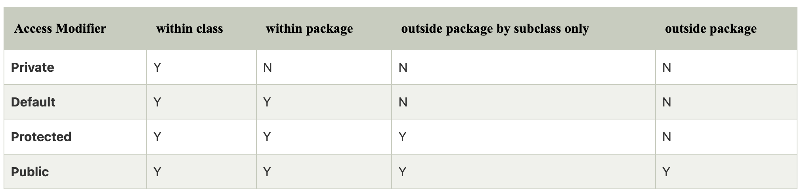

### Understanding Java Access Modifiers

Let's understand the access modifiers in Java by a simple table.





### Native Keyword in java

The `native` keyword essentially allows Java to **interface with native code** (code that runs outside the Java Virtual Machine or JVM), which is often done via **Java Native Interface (JNI)**.

### Key Points:

1.  **Method Declaration**:

    -   The `native` keyword is used in method declarations to specify that the method's implementation is provided externally (usually in a native library).
2.  **Native Code**:

    -   Native methods are typically implemented in languages like **C** or **C++**. These methods are compiled to platform-specific machine code, and Java calls into these methods through JNI.
3.  **JNI (Java Native Interface)**:

    -   JNI is a framework that allows Java code running in the JVM to call and be called by applications and libraries written in other languages like C, C++, or assembly.
4.  **No Method Body in Java**:

    -   A method declared as `native` does not have a body in the Java source code. Instead, the body is provided by the native code that the JVM will link to.

### Syntax Example:

```
public class NativeExample {

    // Declare a native method
    public native void myNativeMethod();

    // Load the native library
    static {
        System.loadLibrary("NativeLibrary");
    }

    public static void main(String[] args) {
        NativeExample obj = new NativeExample();
        obj.myNativeMethod();  // Call the native method
    }
}

```

### How It Works:

1.  **Native Method Declaration**: The `myNativeMethod` method is declared as `native`, which means it will not be implemented in Java but will have an implementation in some other language (like C or C++).

2.  **Native Library Loading**: The `System.loadLibrary("NativeLibrary")` call loads the native library (`NativeLibrary.dll`, `libNativeLibrary.so`, etc.) that contains the actual implementation of the native method.

3.  **JNI**: When you call `myNativeMethod()`, the JVM uses JNI to look for the corresponding implementation in the native library and invokes that method.

### Example of C Implementation (for the above Java code):

```
#include <jni.h>
#include <stdio.h>
#include "NativeExample.h"  // The header file generated by javah

JNIEXPORT void JNICALL Java_NativeExample_myNativeMethod(JNIEnv *env, jobject obj) {
    printf("This is a native method implementation in C!\n");
}

```

-   The C code provides the actual implementation of `myNativeMethod()`, and it must match the signature specified in the Java class (e.g., `Java_NativeExample_myNativeMethod`).

-   After compiling the C code into a shared library (`libNativeLibrary.so` or `NativeLibrary.dll`), the Java program can invoke the native method via JNI.

### Why Use `native` Methods?

-   **Performance**: Sometimes, certain operations (such as those that interact with hardware or require high-performance computing) are much faster when implemented in a low-level language like C or C++.

-   **Access to Platform-Specific Features**: Native methods allow Java programs to access operating system-specific functionality that isn't available in the Java standard library, such as direct hardware access or integration with legacy systems.

-   **Interfacing with Existing Code**: If there is already a C or C++ library that provides required functionality, you can use JNI to call that code from Java without re-implementing the functionality in Java.

### Important Notes:

1.  **Portability**: One downside of using `native` methods is that it can reduce the portability of the application. Native code is typically platform-dependent, so the application might need different native libraries for different operating systems (e.g., Windows, Linux).

2.  **JVM Dependency**: The JVM must be able to load the native library at runtime. This means that the native code must be available and properly configured for the platform on which the Java program is running.

3.  **Error Handling**: Since native methods interact with low-level system resources, error handling can be more complex, and it's possible to encounter issues like memory leaks, crashes, and system-specific errors if not carefully implemented.

### Conclusion:

The `native` keyword in Java is used to declare methods that are implemented in languages other than Java, typically C or C++. These methods allow Java programs to access system-level functionality, interact with existing code written in other languages, or achieve high performance for specific tasks. However, using `native` methods requires careful management of platform dependencies and error handling.