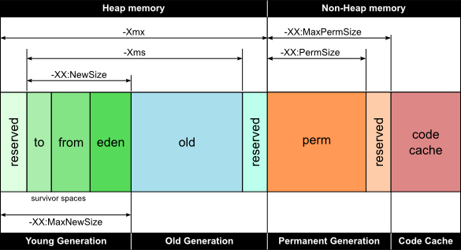

 

 

<figure class="wp-block-table"><table><tbody><tr><th>VM Switch</th><th>VM Switch Description</th></tr><tr><td>-Xms</td><td>For setting the initial heap size when JVM starts</td></tr><tr><td>-Xmx</td><td>For setting the maximum heap size.</td></tr><tr><td>-Xmn</td><td>For setting the size of the Young Generation, rest of the space goes for Old Generation.</td></tr><tr><td>-XX:PermGen</td><td>For setting the initial size of the Permanent Generation memory</td></tr><tr><td>-XX:MaxPermGen</td><td>For setting the maximum size of Perm Gen</td></tr><tr><td>-XX:SurvivorRatio</td><td>For providing ratio of Eden space and Survivor Space, for example if Young Generation size is 10m and VM switch is&nbsp;-XX:SurvivorRatio=2 then 5m will be reserved for Eden Space and 2.5m each for both the Survivor spaces.&nbsp;The default value is 8.</td></tr><tr><td>-XX:NewRatio</td><td>For providing ratio of&nbsp;old/new generation sizes. The default value is 2.</td></tr></tbody></table></figure>

 

Apart from the heap memory, JVM also contains another type of memory which is called as Permanent Generation or "PermGen". 

**PermGen Memory:** This is a special space in java heap which is separated from the main memory where all the [static content is stored](https://www.geeksforgeeks.org/understanding-storage-of-static-methods-and-static-variables-in-java/) in this section. Apart from that, this memory also stores the application metadata required by the JVM. Metadata is a data which is used to describe the data. Here, garbage collection also happens like any other part of the memory. String pool was also part of this memory before Java 7. Method Area is a part of space in the PermGen and it is used to store the class structure and the code for methods and constructors. The biggest disadvantage of PermGen is that it contains a limited size which leads to an [OutOfMemoryError](https://www.geeksforgeeks.org/understanding-outofmemoryerror-exception-java/). The default size of PermGen memory is 64 MB on 32-bit JVM and 82 MB on the 64-bit version. Due to this, JVM had to change the size of this memory by frequently performing Garbage collection which is a costly operation. Java also allows to manually change the size of the PermGen memory. However, the PermGen space cannot be made to auto increase. So, it is difficult to tune it. And also, the garbage collector is not efficient enough to clean the memory. 

Due to the above problems, PermGen has been completely removed in Java 8. In the place of PermGen, a new feature called Meta Space has been introduced. MetaSpace grows automatically by default. Here, the garbage collection is automatically triggered when the class metadata usage reaches its maximum metaspace size. 

The following table describes the difference between metaspace and PermGen: 

| PermGen | MetaSpace |
| --- | --- |
| It is removed from java 8. | It is introduced in Java 8. |
| PermGen always has a fixed maximum size. | Metaspace by default auto increases its size depending on the underlying OS. |
| Contiguous Java Heap Memory. | Native Memory(provided by underlying OS). |
| Inefficient garbage collection. | Efficient garbage collection.

